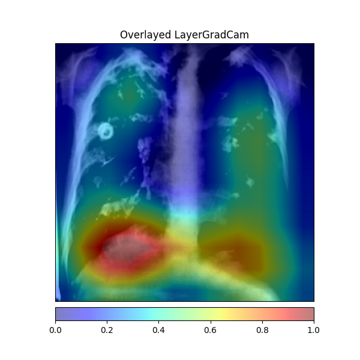

# Medical Data Science Project

This repository contains the code and documentation for the medical data science project for the lecture at HWR Berlin.

## Team Members

- Fabian Friedrich
- Amelia Witon
- Konstantin Lobmayr

## Dataset

[https://dataverse.harvard.edu/dataset.xhtml?persistentId=doi:10.7910/DVN/WNQ3GI](https://dataverse.harvard.edu/dataset.xhtml?persistentId=doi:10.7910/DVN/WNQ3GI)  
We used a dataset consisting of medical images for our project. The dataset includes the following classes and their corresponding number of samples:

- COVID-19: 4,189 samples (label 0)
- Lung-Opacity: 6,012 samples (label 1)
- Normal: 10,192 samples (label 2)
- Viral Pneumonia: 7,397 samples (label 3)
- Tuberculosis: 4,897 samples (label 4)

The total number of samples in the dataset is 32,687.

## Preprocessing

The images were preprocessed using CLAHE to enhance Contrast.

## Model Training

We trained two models, ResNet50 and ResNet18, using PyTorch. These models are widely used for image classification tasks.

## Grad CAM and Saliency

To analyze the models' predictions and understand their decision-making process, we used Captum, a PyTorch library for model interpretability. Specifically, we applied Grad CAM and Saliency techniques to visualize the important regions in the input images that contribute to the model's predictions.

### Covid 19

### Tuberculosis

## License

See [License](LICENSE)
